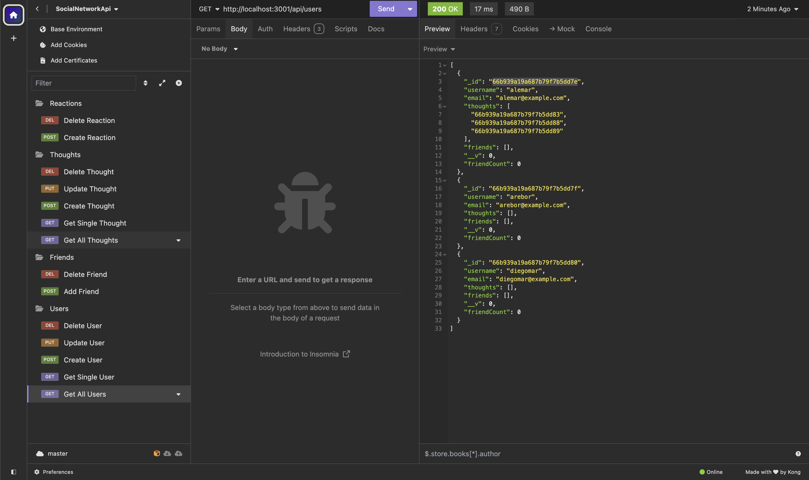
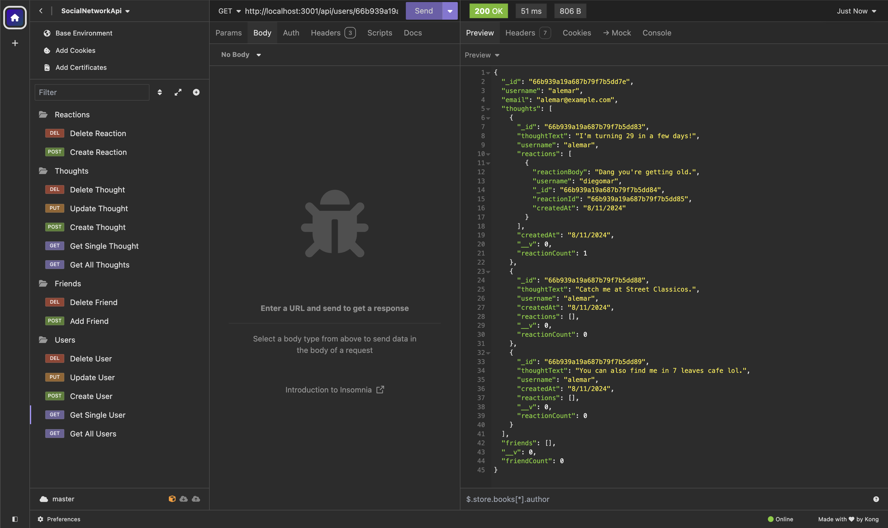

# Social Network API

## Description

This is an API built for a Social Network Web Application where users can
share thoughts, react to friends thoughts and create a friends list.

## Built with

- Node JS
- Express JS
- Mongo DB
- Mongoose

## Links

[Link to Demo Video](https://www.loom.com/share/431a4c8b7e55480c9529c2e31bf7c694?sid=4a73e328-2f0d-483d-8f60-808c6f3385df)

## Screenshot

